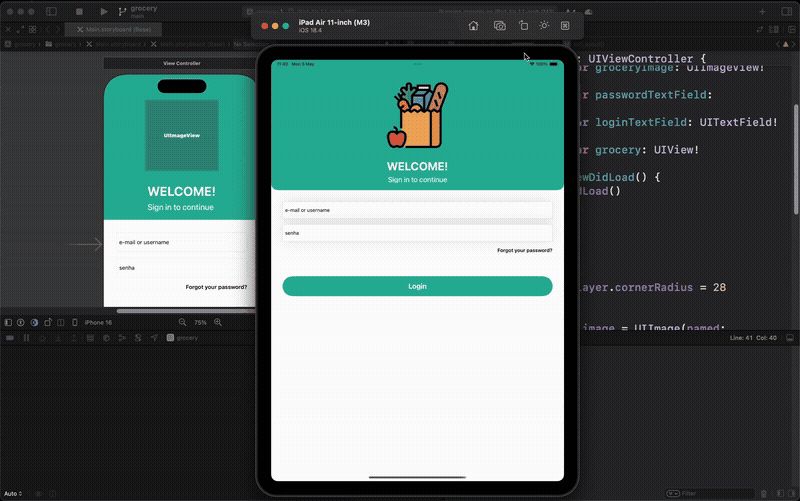

# Grocery App

A simple login grocery app built with Swift and UIKit.

This project was developed as an activity for the course "Introdução ao desenvolvimento mobile (iOS)" from TIC em Trilhas platform, Module 4.

## Visualization

## Specifications

## Implementation Knowledge Used

This project demonstrates the following iOS development concepts:

- **Storyboard and Xcode**: Interface design using Xcode's visual editor
- **Outlets and Actions**: Connecting UI elements to Swift code for each component
- **Auto Layout and Constraints**: Responsive design that adapts to different screen sizes
- **Stack Views**: Organized layout management for simplified interface design
- **Optionals**
- **Navigation Controller**
- **Protocols, Delegates and Extensions**
- **Table View**

