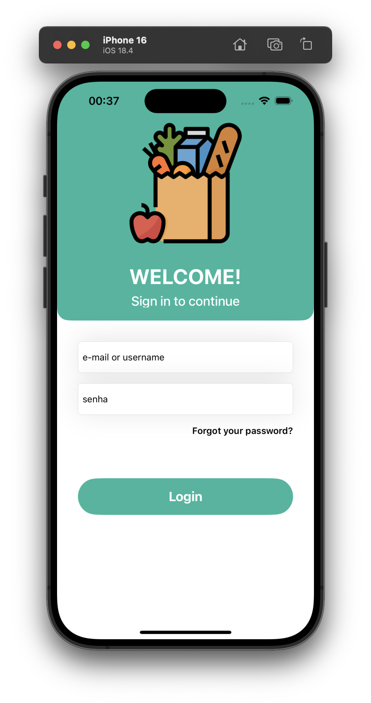
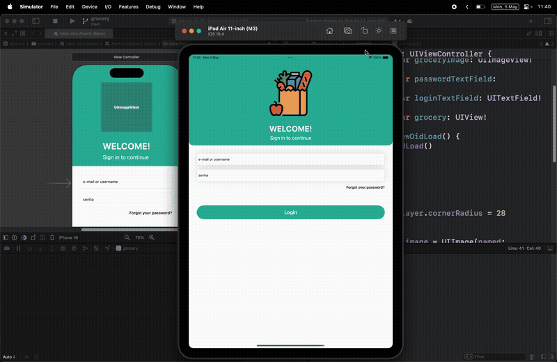

# Grocery App Login Screen

A simple login screen for a grocery app built with Swift.

## Implementation Knowledge Used

This project demonstrates the following iOS development concepts:

- **Storyboard and Xcode**: Interface design using Xcode's visual editor
- **Outlets and Actions**: Connecting UI elements to Swift code for each component
- **Auto Layout and Constraints**: Responsive design that adapts to different screen sizes
- **Stack Views**: Organized layout management for simplified interface design

## Screenshot

